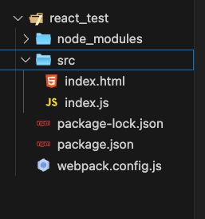

<!--
 * @Author: Chengya
 * @Description: Description
 * @Date: 2025-09-15 14:02:29
 * @LastEditors: Chengya
 * @LastEditTime: 2025-09-15 14:40:19
-->

### React 使用方式

#### 一、 在 index.html 中以 script 标签的形式引入使用 React

1.  通过 npm init -y 初始化一个项目
2.  安装 react 和 react-dom npm i react react-dom
3.  创建一个 index.html,并将 react 以及 react-dom 在 index.html 里以 script 标签的形式引用。
4.  在 index.html 中 使用 react 来创建和渲染 dom 即可

- 需要注意的是，这种方式不用打包工具时只能用 UMD 版本，且不能直接使用 jsx 语法(浏览器不识别)

##### 示例

```html
<!DOCTYPE html>
<html lang="en">
  <head>
    <meta charset="UTF-8" />
    <meta name="viewport" content="width=device-width, initial-scale=1.0" />
    <meta http-equiv="X-UA-Compatible" content="ie=edge" />
    <title>Document</title>
  </head>
  <body>
    <div id="app"></div>
    <!-- 引入react相关文件 -->
    <script src="./node_modules/react/umd/react.development.js"></script>
    <script src="./node_modules/react-dom/umd/react-dom.development.js"></script>
    <script>
      // 使用react创建dom 参数1：元素名称，参数2：元素属性， 参数3：元素子节点
      let myDom = React.createElement("h1", { id: "myDom" }, "hello world");
      //渲染dom 参数1：要渲染的dom，参数2：当前dom要挂载到的地方
      ReactDOM.render(myDom, document.getElementById("app"));
    </script>
  </body>
</html>
```

#### 二、使用脚手架工具(Create React App)来初始化 React 项目并创建自己的 React 应用

使用脚手架工具初始化 React 项目

```bash
npx create-react-app my-app
或全局安装 create-react-app; npm install -g create-react-app 然后使用 create-react-app my-app 初始化项目
cd my-app
npm start
```

- 使用脚手架工具会帮我们自动配置 React 的引入和构建环境，实现 开箱即用、 JSX、模块化、热更新，直接使用现代前端生态。

#### 三、 通过 npm/yarn 安装并通过模块导入的方式使用(手动搭建 React 的开发环境)

1. 通过 npm init -y 初始化项目

2. 配置 react 开发环境 安装 webpack、webpack-cli、webpack-dev-server、html-webpack-plugin;

   安装 react 相关依赖 react、react-dom;

   npm i webpack webpack-cli webpack-dev-server html-webpack-plugin -D (开发依赖)

   npm install react react-dom -S（生产依赖）

3. 根目录下创建 src 目录，在 src 创建 index.html 和 index.js
4. 根目录创建 webpack.config.js 文件，添加打包配置

#### 目录结构如下



#### webpack.config.js 配置文件如下

```js
/*
 * @Author: Chengya
 * @Description: Description
 * @Date: 为项目做webpack 打包相关的配置
 * @LastEditors: Chengya
 * @LastEditTime: 2025-09-11 13:01:40
 */

//import path from "path"; //Node.js 内置模块，用来处理路径问题   Node 默认加载 .js 文件时走 CommonJS的模块引入方式 → 只能用 require/module.exports。 这里使用 import 引入 相当于使用的 ES 模块的引入方式(import/export default)会报错
const path = require("path");
/*
html-webpack-plugin 是 Webpack 的一个常用插件，可以基于指定的模板自动生成 HTML 文件，并在打包时自动将生成的 JS、CSS 等资源插入到 HTML 中。
*/
//import HtmlWebpackPlugin from "html-webpack-plugin";
const HtmlWebpackPlugin = require("html-webpack-plugin");
/*
 新建一个 HtmlWebpackPlugin 实例，并赋值给 htmlPlugin
*/
const htmlPlugin = new HtmlWebpackPlugin({
  template: path.join(__dirname, "./src/index.html"), //以src/index.html 这个模板为基础生成最终的 HTML
  filename: "index.html", //生成出来的 HTML 文件名，这里是 index.html 也可以改为其他名字 Webpack 打包后会在 dist 目录下生成这个 index.html，并自动注入打包后的 JS、CSS 文件链接。
});
module.exports = {
  mode: "development", // 可选配置 development/production
  /*
   开发模式会默认启用(不写mode 默认是development模式)：未压缩的输出文件（便于调试），更快的构建速度，有默认的调试信息。

   生成环境(production):会自动压缩代码，Tree Shaking(分析哪些导出的代码没有被用到，打包时剔除未引用的部分) Scope Hoisting（作用域提升,自动把模块包装优化成一个函数块，减少闭包、加快运行速度，体积也变小）等优化
  */

  plugins: [htmlPlugin],
  /*
  webpack 的plugins 接受一个插件数组，要用的插件放在这个数组，webpack 在打包时就会执行plugins中的插件，
  在这里打包时通过HtmlWebpackPlugin的实例 htmlPlugin 基于 src/index.html 模板生成最终的 dist/index.html，
  并自动注入 <script src="bundle.js"> 等资源标签。

  做好配置后，在package.json 添加上打包 命令  "build": "webpack", 执行 npm run build 时 就会使用webpack 基于当前配置来进行打包了

  需要注意的是当期项目安装的 webpack/webpack-cli 版本 和 当前项目使用的 node 版本的关系，如果不匹配(webpack/webpack-cli版本高 node 版本低) 可能会在运行或者打包时报错
  这时需要确定匹配对应关系 降级webpack/webpack-cli 或者 升级 node 到对应版本 重新安装依赖尝试
  */
};
```

安装好需要的 react 依赖 以及 配置好打包工具后,在 index.html 中 添加一个 id 为 app 容器 作为项目的根容器,我们将来写的页面会出现在根容器。

```html
<!DOCTYPE html>
<html lang="en">
  <head>
    <meta charset="UTF-8" />
    <meta name="viewport" content="width=device-width, initial-scale=1.0" />
    <title>Document</title>
  </head>
  <body>
    <div id="app"></div>
  </body>
</html>
```

接下来我们就可以在 index.js 中用 react 创建 dom 元素并渲染到页面了。

index.js 中 使用 React 创建虚拟 dom 示例

```js
//index.js
console.log("你好，世界");
import React from "react"; //react 是用来创建dom结构/组件,组件的生命周期都在这个包里面
import ReactDom from "react-dom"; //react-dom用来进行操作dom,主要的应用场景，是ReactDom.render()
// 创建虚拟dom
const myDom = React.createElement("h1", { id: "Box" }, "我是一个h1标签");
// n1:字符串类型参数，代表需要创建的dom元素标签名
// n2:对象类型的参数 代表创建元素的属性节点
// n3:子节点 包含文本节点
ReactDom.render(myDom, document.getElementById("app"));
//ReactDom.render 包含两个参数：需要渲染的dom元素，以及制定的dom容器（一个dom对象）
```

- #### 可以看到，这样创建 dom 比较麻烦，我们更希望以一种写 html 的方式来快速的创建虚拟 dom，这就需要使用 jsx 语法。
