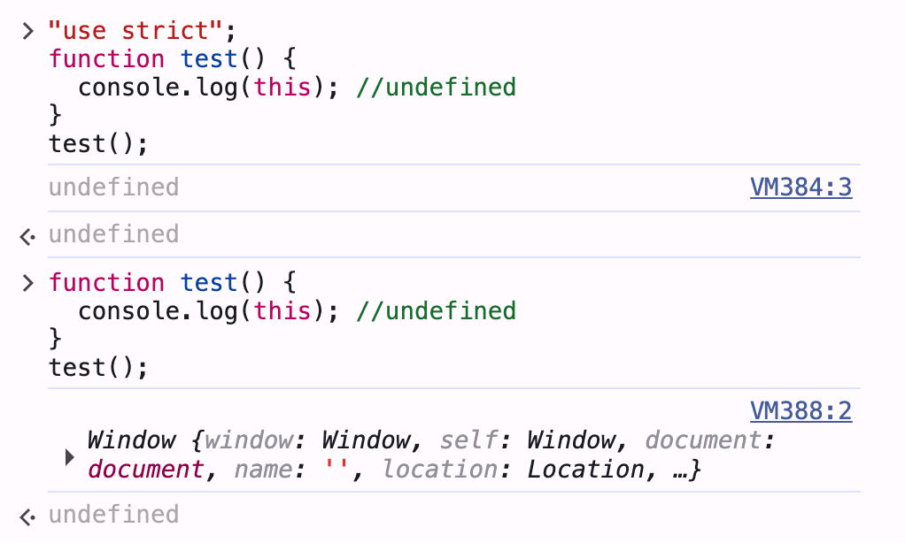

<!--
 * @Author: Chengya
 * @Description: Description
 * @Date: 2025-09-15 16:45:41
 * @LastEditors: Chengya
 * @LastEditTime: 2025-09-16 11:13:11
-->

### React 中事件的绑定

- 在 react 中有一套自己的事件绑定机制，事件名小驼峰命名，参数必须为一个函数

react 中事件绑定的方式

- 1. 使用箭头函数绑定
- 2. 使用 bind 绑定

示例

```jsx
import React from "react";
import ReactDOM from "react-dom";

class BindEvent extends React.Component {
  constructor() {
    super();
    this.state = {
      num: 100,
    };
    // 方式1：构造器里手动 bind
    this.clickEvent1 = this.clickEvent1.bind(this);
  }

  // 普通方法 + 手动 bind
  clickEvent1() {
    console.log("方式1：constructor bind");
    console.log(this, "this==");
    console.log(this.state.num, "num==");
  }

  // 直接普通方法（没 bind，会丢 this）
  clickEvent2() {
    console.log("方式2：普通方法没 bind");
    console.log(this, "this=="); // undefined
    // console.log(this.state.num) // 报错
  }

  // 类字段写法（箭头函数自动绑定 this）
  clickEvent3 = () => {
    console.log("方式3：类字段箭头函数");
    console.log(this, "this==");
    console.log(this.state.num, "num==");
  };

  render() {
    return (
      <div>
        <h3>不同事件绑定方式对比</h3>
        <hr />

        {/* 方式1：构造器bind的普通方法 */}
        <button onClick={this.clickEvent1}>点击1（bind后普通方法）</button>

        <hr />

        {/* 方式2：普通方法直接传，this 丢失 */}
        <button onClick={this.clickEvent2}>点击2（没bind普通方法）</button>

        <hr />

        {/* 方式3：箭头函数属性，天然绑定 this */}
        <button onClick={this.clickEvent3}>点击3（箭头函数属性）</button>

        <hr />

        {/* 方式4：在事件里用箭头函数调用普通方法 */}
        <button onClick={() => this.clickEvent2()}>
          点击4（事件内箭头函数调用普通方法）
        </button>

        <hr />

        {/* 方式5：onClick={this.clickEvent()}，render时就执行 */}
        <button onClick={this.clickEvent3()}>
          点击5（render时就执行一次）
        </button>
      </div>
    );
  }
}

ReactDOM.render(<BindEvent />, document.getElementById("root"));
```

🔹 效果：

点击 1：正常打印 this 和 num，因为手动 bind 了。

点击 2：this 是 undefined，不能访问 state。

点击 3：正常打印，因为箭头函数属性自动绑定。

点击 4：点击时调用箭头函数，再调用普通方法，此时 this 是组件实例。

点击 5：组件渲染时就执行一次 clickEvent3，点击不会再执行。

### JS 中 this 的基础规则

- 1. 普通函数调用：fn() → this 在严格模式下是 undefined，非严格模式是 window
- 2. 对象方法调用：obj.fn() → this 是 调用方法的 obj
- 3. 箭头函数：没有自己的 this，会捕获定义时外层的 this（继承定义箭头函数的父上下文的 this）。

普通函数中的 this

```js
//严格模式
"use strict";
function test() {
  console.log(this); //undefined
}
test();

//非严格模式
function test1() {
  console.log(this);
}
test1(); // window
```



- 对象调用函数中的 this

```js
let obj = {
  test: function () {
    console.log(this);
  },
};
obj.test(); //obj 对象
```

- 箭头函数中的 this

```js
//let name = "lucy"; let 和 const：在全局作用域中通过 let 或 const 声明的变量 不会 成为 window 的属性，而是成为了 块级作用域 中的变量 如果这里使用 let 声明变量 name, 那么 person.say() 执行 打印 undefined
var name = "lucy"; //在全局作用域中通过 var 声明的变量，会成为 window 对象的属性
let person = {
  name: "tom",
  say: () => {
    console.log(this.name);
  },
  say1: function () {
    let sayTest = () => {
      console.log(this.name);
    };
    return sayTest();
  },
};
person.say(); // lucy.   say 箭头函数中的 this 指向箭头函数定义时所在的父 （person） 执行上下文的 this,非严格模式和node 环境下 也就是 window    window.name = 'lucy'
person.say1(); // tom.   say1() 执行的是箭头函数 sayTest()  sayTest 中的 this 指向 定义它的父 say1 上线文的this,也就是person
```

### React 中事件处理机制的总结

在 React 中，事件处理函数中的 this 默认不会自动绑定到组件实例。

React 在调用传进去的事件处理函数时，只是普通函数调用，不会自动把 this 变成组件实例。如果这个方法没有自己绑定 this（.bind(this) 或箭头函数），那么执行时的 this 就是 undefined。

```jsx
<button onClick={this.handleClick}>点击</button>
/*
这里的 this.handleClick 只是把一个“函数引用”交给 React，React 在内部会做类似如下的处理

React 内部点击时
buttonElement.addEventListener('click', function(event) {
  //这里调用你传进来的函数
  props.onClick(event)
})

React 不会帮你自动 .bind(this) 到组件实例，所以当事件触发时，React 调用你的函数就像普通函数一样：fn(event)
在严格模式下，普通函数调用的 this 是 undefined, 非严格模式下 指向window。因此 需要使用箭头函数 或者 bind 方式来让this
指向 组件实例。
*/
```
