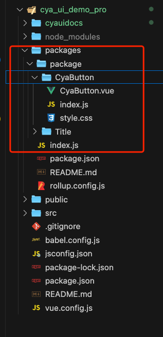
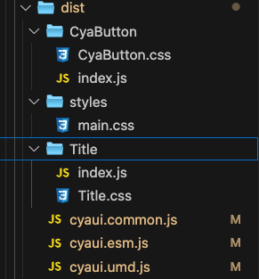

<!--
 * @Author: Chengya
 * @Description: Description
 * @Date: 2025-02-05 17:28:29
 * @LastEditors: Chengya
 * @LastEditTime: 2025-02-06 15:01:51
-->

# 基于 vue2 创建一个 vue 组件库

## 准备工作

1. 使用 vue 脚手架工具初始化一个模板项目（vue create projectName）
2. 运行模板项目，去除无用内容
3. 项目根目录下创建 packages 目录 作为组件开发的根目录，在 packages 下建立 package 目录，将来创建的组件放在 package 目录下
4. 定义组件 比如定义一个简单的 Button 按钮, package 下建立 CyaButton 目录 ，并在该目录下建立 CyaButton.vue（组件内容）和 index.js （Button 组件的入口文件 为了方便将来组件导出发布）和 当前组件的样式 style.css
5. packages 目录下 创建 index.js 组件库的入口文件（以便将来对于组件进行统一的导出管理）

   目录结构如下

   

## 组件库的开发

### Button 按钮代码 CyaButton.vue

```vue
<!--
 * @Author: Chengya
 * @Description: Description
 * @Date: 2024-12-13 09:42:42
 * @LastEditors: Chengya
 * @LastEditTime: 2024-12-13 17:19:07
-->
<template>
  <button
    class="btn_cya"
    :class="[type, { disabled, loading }]"
    :disabled="disabled || loading"
    @click="handleClick"
  >
    <span v-if="loading" class="btn_spinner"></span>
    <slot></slot>
  </button>
</template>

<script>
export default {
  name: "CyaButton",
  props: {
    type: {
      type: String,
      default: "default",
    },
    disabled: {
      type: Boolean,
      default: false,
    },
    loading: {
      type: Boolean,
      default: false,
    },
  },
  data() {
    return {};
  },
  methods: {
    handleClick() {
      console.log("按钮点击事件");
      this.$emit("click");
    },
  },
};
</script>
<style scoped src="./style.css"></style>
```

### Button 按钮的入口文件 index.js

```js
/*
 * @Author: Chengya
 * @Description: Description
 * @Date: 2024-12-13 09:42:51
 * @LastEditors: Chengya
 * @LastEditTime: 2024-12-13 16:52:49
 */
/*
通过添加install方法 以便将来可以 通过 Vue.use()的方式在全局注册使用,添加的install方法并不影响组件本身 只是向
Vue 提供了一个安装接口。通过 Vue.use(CyaButton) 可以全局注册该组件。
*/
import CyaButton from "./CyaButton.vue";
CyaButton.install = function (Vue) {
  if (CyaButton.install.installed) return;
  if (!CyaButton.name) {
    console.error("Component is missing a name:");
  } else {
    Vue.component(CyaButton.name, CyaButton);
  }
  CyaButton.install.installed = true;
};
export { CyaButton }; //为了能够按需引用
export default CyaButton; //为了能够全局注册使用
```

### Button 按钮的样式文件 styles.css

```css
.btn_cya {
  padding: 10px 20px;
  cursor: pointer;
  border: none;
  outline: none;
  transition: all 0.3s;
}
.btn_cya.default {
  background-color: #fff;
  color: #333;
  border: 1px solid #ccc;
}
.btn_cya.primary {
  background-color: skyblue;
  color: gray;
  border: 1px solid skyblue;
}
.btn_cya.danger {
  background-color: red;
  color: white;
  border: 1px solid red;
}
.btn_cya.disabled {
  cursor: not-allowed;
  background-color: #f5f5f5;
  color: #ccc;
}
.btn_cya.loading {
  position: relative;
  display: flex;
  align-items: center;
}
.btn_spinner {
  display: inline-block;
  width: 14px;
  height: 14px;
  border: 2px solid gray;
  border-radius: 50%;
  border-top-color: pink;
  animation: spin 1s linear infinite;
  margin-right: 8px;
}
@keyframes spin {
  0% {
    transform: rotate(0deg);
  }
  100% {
    transform: rotate(360deg);
  }
}
```

### 组件根目录 packages 的入口文件 index.js(将来组件多了通过该入口统一管理)

```js
/*
 * @Author: Chengya
 * @Description: Description
 * @Date: 2024-12-13 09:44:10
 * @LastEditors: Chengya
 * @LastEditTime: 2024-12-13 16:04:50
 */
console.log("当前版本：", process.env.VERSION);
import CyaButton from "./package/CyaButton/index";
import CyaTitle from "./package/Title/index";
const components = [CyaButton, CyaTitle]; // index.js 建立的目的 在于 将来如果定义的组件多了 可以统一通过这个入口文件 全部引用
//定义 install 方法 用于将组件库注册为 Vue 的插件
const install = function (Vue) {
  if (install.installed) return;
  components.map((component) => {
    if (!component.name) {
      console.error("Component is missing a name:", component);
    } else {
      Vue.component(component.name, component);
    }
  });
};
//检查是否直接以 <script> 标签的方式引入 如果检测到 window.Vue 存在，说明 Vue 已经被全局引入，直接调用 install 方法完成自动安装。
if (typeof window !== "undefined" && window.Vue) {
  install(window.Vue);
}
//具体的组件，便于按需引入和使用。
export { CyaButton, CyaTitle };
export default {
  install, //install 方法，用于支持全局注册安装使用 Vue.use()。
};
```

## 组件库的打包

### 打包

#### 为组件库根目录初始化 package.json

packages 根目录 通过 npm init 或手动创建 创建 package.json

以下是关于 package.josn 关键内容的说明

```js
    "name": "cya_vue_ui" 组件库名称
    "version": "1.0.0", 组件库版本号 后续更新版本发布到 npm 时要修改版本号  执行 npm version patch 自动更新版本号
    "description": "vue 组件", 组件库描述
    "main:'index.js" 组件库入口文件
    "scripts": {
    "build": "rollup -c"
    }, 将来配置打包命令
    "keywords": [
    "vue"
    ], 描述项目相关关键词。当其他人在 npm 搜索时，如果输入了与 keywords 中的某个词匹配的内容，能更容易地找到内容。
    "peerDependencies": {
    "vue": "^2.6.0"
    },
    指明了组件库与哪些版本的 Vue 是兼容的。它告诉用户，组件库依赖 Vue，但不应该由当前库直接安装 Vue，而是由使用库的项目来安装 Vue。这样可以避免版本冲突
    假设你发布的组件库是基于 Vue 2.x 的，而使用者可能已经在项目中安装了 Vue，你的组件库只需要声明它与 Vue 的兼容性，而不是重新安装 Vue。
    这里 vue:'^2.6.0' 的含义： ^ 表示“兼容版本范围”，这意味着组件库可以兼容 所有 2.x.x 的版本，只要它们大于或等于 2.6.0 即可
    "dependencies":{
    }
    组件库依赖的其他包 如果组件库依赖其他包 别人通过 npm install 来安装组件库时 依赖的其他包会一起安装
    在 package.json 中定义 dependencies 字段时，意味着你的组件库依赖某个包，并且你希望这个包随你的组件库一起安装。也就是说，如果你的组件库依赖某个包，比如 vue，那么当别人通过 npm install 安装你的组件库时，vue 会被一起安装进来。用于列出你的组件库直接依赖的第三方库(如 loadsh /axios)，它们会在用户安装组件库时自动安装。
    "devDependencies":{
    }
    这里的配置是组件库开发和打包时所需的依赖，只有在开发你的组件库时需要它们，用户安装你的组件库时不会安装这些内容

    手动添加以下内容
    "main": "dist/cya_vue_ui.common.js", 替换  "main:'index.js"
    "module": "dist/cya_vue_ui.esm.js", 新增
    "unpkg": "dist/cya_vue_ui.umd.js", 新增

    main、module 和 unpkg 是让组件库支持不同使用环境的关键配置
    main,moudle,unpkg 配置这些字段是为了指明组件库的不同版本（满足 CommonJS 规范的入口文件，ES Moudle 格式的入口文件 和 UMD 格式的入口文件），他们是打包后文件的路径
    目的在于将来发布后使用者可以根据自己的环境选择合适的版本。发布组件时，手动添加这些字段，并让他们指向正确的打包输出文件，这样打完包之后 会在对应的路径生成不同格式的文件。

    main：指定组件库的入口文件，通常是 CommonJS 格式（用于 Node.js 构建工具）。
    很多传统的构建工具（如 Node.js 环境和一些老旧的构建工具）都支持 CommonJS 模块格式。
    这个字段使得使用你的组件库的开发者可以通过 require('cya_vue_ui') 来导入你的库。
    对于没有配置这个字段的组件库，require 或 import 可能找不到入口文件，导致无法正常使用

    module：指定 ES Module 格式的入口文件，这对于现代构建工具（如 Webpack、Rollup、Vite 等）非常重要，因为它们可以直接使用 ES Module 语法来进行优化。
    ES Module 格式支持更好的 tree shaking（去除未使用的代码）和更高效的构建。
    使用 module 字段可以让这些现代工具直接加载你的组件库并优化打包。
    如果没有配置 module 字段，现代的构建工具可能会退回到 main 字段配置的 CommonJS 格式，可能无法充分优化。

    unpkg：指定 UMD 格式的入口文件，适用于在浏览器中通过 <script> 标签引入时使用。
    UMD 是一个兼容多个模块化环境的格式，既适用于浏览器中通过 <script> 标签引入，也适用于 Node.js 环境。
    当你的组件库被通过 CDN 引入（如使用 unpkg.com）时，这个字段可以帮助浏览器识别并加载正确的文件。
    如果没有配置 unpkg，当用户通过 CDN 引入你的组件库时，可能无法正确加载和运行
```

#### 打包配置

进行打包配置 使用 webapack/rollup (这里以 rollup 为了 做打包配置)

#### 打包工具 rollup 和 webpack 的一些情况对比

##### 1.设计理念与主要用途

Rollup

- 模块化打包工具，专注于生成 库 和 组件 的打包输出。

- 其核心目标是生成高效、紧凑的打包文件，特别适用于构建 JavaScript 库 或 组件库。

- Rollup 的重点是生成 ES Module（ESM）格式的代码，这对于现代浏览器和构建工具（如 Vite、Webpack 等）来说具有很高的兼容性和优化潜力。

Webpack

- 更为通用的打包工具，不仅支持 JavaScript 文件的打包，还支持 CSS、图片、字体等资源的打包。
- 适合大型 前端应用程序 的打包，能够处理多种类型的资源和更复杂的构建需求。
- Webpack 的功能非常强大，通过插件和 loader 可以实现各种自定义需求，适用于各种项目。

##### 2.打包优化与输出格式

Rollup

- Tree shaking：Rollup 的 tree shaking（去除未使用代码）做得非常好，能够精确地删除无用的代码，使得打包后的文件非常小。

- 输出格式：Rollup 支持多种输出格式，如 CommonJS、ESM、UMD 等。默认输出是 ES Module 格式，这使得它非常适合用于构建 JS 库和组件。

- 构建速度：Rollup 的构建速度通常比较快，特别是在构建 库 或 组件 时，由于其对 模块系统 的优化，可以减少打包过程中的开销。

Webpack

- Tree shaking：Webpack 在较新的版本（Webpack 2+）也支持 tree shaking，但它的优化效果通常不如 Rollup。

- Webpack 的优化需要更细致的配置。

- 输出格式：Webpack 更加灵活，支持 CommonJS、ESM、UMD、等多种格式。Webpack 更适合需要多个文件和资源（如图片、CSS、HTML）的应用程序。

- 构建速度：Webpack 相比于 Rollup，构建速度可能会稍慢，特别是当项目规模非常大时。

##### 3. 插件和功能

Rollup

- 相较于 Webpack，Rollup 的插件生态系统较为简单，主要聚焦于 JavaScript 和模块打包，适合库和组件打包。

- Rollup 的插件系统和配置方式相对简单，但功能不如 Webpack 强大和广泛。

Webpack：

- nWebpack 拥有庞大的插件和 loader 生态，几乎支持任何类型的资源和文件（CSS、SASS、LESS、图片、字体、TypeScript、Vue、React 等）。
- 通过插件和 loader 的组合，Webpack 可以处理复杂的构建流程等。

##### 4. 配置复杂性

Rollup

- 配置相对简单，尤其适合小型项目或库的打包。Rollup 的配置文件通常较为简洁，易于理解。

- 适合那些对构建过程不需要过多自定义的场景，尤其是库或组件的开发。

Webpack

- 配置较为复杂，尤其是涉及到多种资源（如图片、CSS、TypeScript 等）时，配置可能会比较庞大。
- Webpack 的灵活性很高，能够满足各种复杂的构建需求，但也意味着配置的复杂度较大。

##### 5. 使用场景

Rollup

- 适合 构建 JavaScript 库 或 组件库。如果要创建一个共享的、可复用的组件库（如 Vue 组件库），Rollup 是非常合适的选择。

- 如果关注代码优化、模块格式（如 ESM）、输出文件体积小，Rollup 会是更好的选择。

Webpack

- 更适合用于构建 前端应用程序，特别是大型 SPA（单页面应用程序）或复杂的多页面应用程序（MPA）。

- Webpack 对 资源处理（CSS、图片、字体等）和 开发模式（如热更新、动态加载、代码分割）有非常好的支持。

##### 6. 构建速度与文件体积

Rollup

- Rollup 的打包速度和生成的文件体积通常会比 Webpack 更小，特别是当项目的主要目标是生成库时。
- Rollup 非常擅长去除未使用的代码，减少冗余部分，生成高效的输出。

Webpack

- Webpack 的构建速度通常比较慢，尤其是对于大规模的前端应用程序。它会生成多个文件（如 CSS、图片、JS 等），适合打包更复杂的项目。

#### 打包工具和相关依赖的安装

安装 rollup 打包相关依赖

需要注意的是这里将 rollup 打包相关的依赖安装到初始化的模板项目的根目录下 这样能够避免在项目根
目录和组件库根目录都安装 node_modules，(组件库和根目录都安装 node_modules 的情况下，
有时候导致两个不同的 node_modules 下安装版本不同的同一个依赖进而在组件库打包的时候出现冲突错误)
比如 rollup-plugin-vue2（适配 vue2.x 的版本）(rollup-plugin-vue2 依赖了 vue-template-compiler，
如果在组件根目录下安装这个插件，有可能会导致根目录下 Vue 和 当前根目录中的
node_modules 下的 vue-template-compiler 版本不一致（vue 和 vue-template-compiler 版本必须一致），
否则会导致编译失败)

安装依赖

```js
npm install rollup@2 rollup-plugin-vue2 @rollup/plugin-babel -D
npm install @babel/preset-env @babel/core -D
npm install rollup-plugin-replace rollup-plugin-postcss rollup-plugin-babel-minify -D
```

rollup:使用 rollup 打包的核心依赖

rollup-plugin-vue:用于处理组件库的.vue 文件，将其转换为可以被 Rollup 识别的 JavaScript 文件 。如果当前使用的 vue 版本是 2.x，要安装 rollup-plugin-vue2

rollup-plugin-babel 将代码通过 Babel 编译，通过 Babel，可以使用现代 JavaScript 语法（如箭头函数、async/await 等），并将其转译为兼容旧浏览器或特定环境的代码。
这个插件通常和 @babel/preset-env 一起使用，后者会根据你支持的浏览器自动决定要编译哪些语法特性。目前 rollup-plugin-babel 已经被弃用，并且不再维护。官方推荐使用
@rollup/plugin-babel 来替代 rollup-plugin-babel，同时为了适配 @rollup/plugin-babel 要安装 适当版本的 rollup（版本号在 >=0.60.0 < 3），这里安装的是
rollup@2（2.x 的版本）

@babel/core 是 Babel 编译器的核心模块，提供了基本的编译功能和 API，使得开发者可以通过 Babel 对 JavaScript 代码进行灵活的转换和编译

rollup-plugin-replace 用于替换环境变量,注入版本号

rollup-plugin-postcss 用于处理和提取 CSS

rollup-plugin-babel-minify 删除注释并压缩处理 js

依赖安装过程如果出现依赖版本的兼容问题，根据报错信息 调整安装对应版本即可

#### 创建打包配置文件 rollup.config.js

根据安装的打包工具和依赖，创建的打包配置文件如下

```js
/*
 * @Author: Chengya
 * @Description: Description
 * @Date: 2024-12-13 10:35:36
 * @LastEditors: Chengya
 * @LastEditTime: 2025-02-06 13:42:18
 */
import path from "path";
import vue from "rollup-plugin-vue2"; //用于处理 Vue 文件
import babel from "@rollup/plugin-babel"; //用于 Babel 转译
import replace from "rollup-plugin-replace"; //用于替换环境变量,注入版本号
//import css from "rollup-plugin-css-only"; // 用于提取 CSS 文件
import postcss from "rollup-plugin-postcss"; // 用于处理和提取 CSS
import pkg from "./package.json"; //引入 package.json，用于获取库的相关信息
import fs from "fs";
import minify from "rollup-plugin-babel-minify";

const componentsDir = path.resolve(__dirname, "package"); //组件源代码 目录
const distDir = path.resolve(__dirname, "dist"); //打包输出目录
//const distStylesDir = path.resolve(__dirname, "dist/styles") 或者 如下
const distStylesDir = path.resolve(distDir, "styles"); //样式输出目录
// 获取所有组件名称
const getComponents = () =>
  fs
    .readdirSync(componentsDir)
    .filter((name) =>
      fs.statSync(path.resolve(componentsDir, name)).isDirectory()
    );
const components = getComponents();
export default [
  {
    input: "./index.js",
    output: [
      {
        file: path.resolve(__dirname, "dist/cyaui.common.js"),
        format: "cjs",
        exports: "named", //值有两种  named/default named 适用于既有命名导出又有默认导出的情况  default 仅适用于只有默认导出的情况
      },
      {
        file: path.resolve(__dirname, "dist/cyaui.esm.js"),
        format: "esm",
        exports: "named",
      },
      {
        file: path.resolve(__dirname, "dist/cyaui.umd.js"),
        format: "umd",
        name: "CyaVueUI",
        exports: "named",
        globals: {
          vue: "Vue", // UMD 格式中 Vue 作为全局变量引入,在 UMD 格式下，告诉 Rollup 在打包时 Vue 是一个全局变量。也就是说，当使用 UMD 格式的组件库时，Vue 会作为全局对象存在，而不是作为模块打包进来。
        },
      },
    ],
    plugins: [
      vue({
        css: true, //使插件 处理组件中的css
      }),
      minify({ comments: false }), // 删除注释并压缩
      babel({
        exclude: "node_modules/**",
        presets: ["@babel/preset-env"],
        babelHelpers: "bundled", // 显式配置 babelHelpers
      }),
      replace({
        "process.env.VERSION": JSON.stringify(pkg.version), // 使用引入的版本号
      }),
      /*
        在这里可以使用 rollup-plugin-css-only 插件 来将样式提取成一个main.css 文件 以便将来在main.js 全部引用时 引入样式
        但是需要注意的是，如果使用 rollup-plugin-css-only 该插件output 期望的是相对路径，识别不了绝对路径 如 css({output:
        path.resolve(distStylesDir, "main.css")}),
        这样使用打包会报错，如果要使用绝对路径，那么需要使用 rollup-plugin-postcss 这个插件
      */
      //css({ output: "styles/main.css" }), // 提取 CSS 到 dist 目录
      postcss({
        extract: path.resolve(distStylesDir, "main.css"),
        minimize: true, // 启用 CSS 压缩
      }),
    ],
    external: ["vue"], // 声明 Vue 是外部依赖，而不是将其包含进最终的打包文件中
  },
  ...components.map((component) => ({
    input: path.resolve(componentsDir, component, "index.js"),
    output: {
      file: path.resolve(distDir, component, "index.js"),
      format: "esm",
      exports: "named",
    },
    plugins: [
      vue({
        css: true,
      }),
      minify({ comments: false }), // 删除注释并压缩
      /*
        该处是想要将每个组件的入口文件和样式在打包时分别打包进对应的组件名目录下，以便将来在前端使用时 配置按需使用时样式和组件的加载
        同样使用 rollup-plugin-css-only 识别不了绝对路径 想要实现目的 只能如下方式来实现 效率不如使用 rollup-plugin-postcss
      */
      // css({
      //   output: (styles) => {
      //     const fs = require("fs");
      //     const componentsDir = path.resolve(__dirname, "package");
      //     const distStylesDir = path.resolve(__dirname, `dist/${component}`);
      //     if (!fs.existsSync(distStylesDir)) {
      //       fs.mkdirSync(distStylesDir, { recursive: true });
      //     }
      //     // 遍历每个组件目录，生成独立样式文件
      //     const styleFile = path.resolve(componentsDir, component, "style.css");
      //     if (fs.existsSync(styleFile)) {
      //       const targetFile = path.resolve(distStylesDir, `${component}.css`);
      //       fs.copyFileSync(styleFile, targetFile);
      //     }
      //   },
      // }),
      postcss({
        extract: path.resolve(distDir, component, `${component}.css`),
        minimize: true, // 启用 CSS 压缩
      }),
    ],
    external: ["vue"],
  })),
];
```

配置完打包文件后，在组件库根目录 package.json 中添加打包命令，
"build": "../node_modules/.bin/rollup -c"
完整的 package.json 文件如下

```js
{
  "name": "cyaui",
  "version": "1.0.1",
  "description": "vue 组件开发尝试",
  "main": "dist/cyaui.common.js",
  "module": "dist/cyaui.esm.js",
  "unpkg": "dist/cyaui.umd.js",
  "files": [
    "dist",
    "README.md"
  ],
  "scripts": {
    "test": "test",
    "build": "../node_modules/.bin/rollup -c"
  },
  "keywords": [
    "vue",
    "vue-component"
  ],
  "peerDependencies": {
    "vue": "^2.6.0"
  },
  "author": "yongan",
  "license": "ISC",
  "dependencies": {}
}
```

完成以上内容后，就可以对组件库进行打包了，在组件库根目录下 执行打包命令 npm run build
进行打包，打包完成后，会在根目录看到生成的 dist 文件夹，打包生成的 dist 如图所示



## 组件库测试

### 打包后组件库是否正常可用可以通过本地链接的方式来验证

组件库根目录下执行 npm link,然后 在当前项目根目录执行 npm link cyaui（组件库名称） 然后 npm run serve 运行，在本地引入后进行测试

## 组件库发布到 npm

### 测试打包的组件库能够正常使用后，可以发布到 npm

具体操作：

组件库根目录 登录 npm （终端执行 npm login） 输入账号和密码以及其他验证后 通过 npm publish 命令 发布到 npm

发布时 如果遇到 npm login 报错:Public registration is not allowed，是因为 npm 的镜像源问题（通过 npm get registry 查看自己的镜像源，如果不是 https://registry.npmjs.org 需要修改。将 npm 的镜像源改为官方 npm config set registry https://registry.npmjs.org，发布完以后，可以再切换回来 npm config set registry https://registry.npmmirror.com（切换回来是为了 避免 npm install 安装依赖时报错）

以上我们就完成了一个组件库的开发、打包、测试、发布的基本都流程，后续可以通过 npm install packageName 在项目中安装使用，后续我们也可以对已发布的组件库来进行更新和维护，但是每次更新后需要变更版本号（npm version patch）才可以重新发布到 npm.
