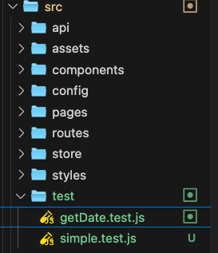

<!--
 * @Author: Chengya
 * @Description: Description
 * @Date: 2025-05-25 17:04:51
 * @LastEditors: Chengya
 * @LastEditTime: 2025-09-15 16:44:15
-->

#### 10.使用 class 关键字创建一个列表组件

```jsx
import React from "react";
import ReactDom from "react-dom";

class Pinglun extends React.Component {
  constructor() {
    super();
    this.state = {
      TextList: [
        { id: 0, name: "张三", words: "哈哈,沙发" },
        { id: 1, name: "李四", words: "啦啦,板凳" },
        { id: 2, name: "王五", words: "哈哈,凉席" },
        { id: 3, name: "赵六", words: "哈哈,砖头" },
        { id: 4, name: "田七", words: "哈哈,楼下山炮" },
      ],
    };
  }
  render() {
    return (
      <div>
        <h3>这是一个评论列表</h3>
        {this.state.TextList.map((item) => (
          <div key={item.id}>
            <h2>评论人：{item.name}</h2>
            <p>评论内容：{item.words}</p>
          </div>
        ))}
      </div>
    );
  }
}
ReactDom.render(
  <div>
    <Pinglun></Pinglun>
  </div>,
  document.getElementById("app")
);
```

#### 11.对以上列表组件的抽离

```jsx
import React from "react";
import ReactDom from "react-dom";
//构造函数创建一个无状态组件应用于评论列表（组件的嵌套）
function Getpinglun(props) {
  return (
    <div>
      <h2>评论人：{props.name}</h2>
      <p>评论内容：{props.words}</p>
    </div>
  );
}
class Pinglun extends React.Component {
  constructor() {
    super();
    this.state = {
      TextList: [
        { id: 0, name: "张三", words: "哈哈,沙发" },
        { id: 1, name: "李四", words: "啦啦,板凳" },
        { id: 2, name: "王五", words: "哈哈,凉席" },
        { id: 3, name: "赵六", words: "哈哈,砖头" },
        { id: 4, name: "田七", words: "哈哈,楼下山炮" },
      ],
    };
  }
  render() {
    return (
      <div>
        <h3>这是一个评论列表</h3>
        {this.state.TextList.map((item) => (
          <Getpinglun {...item} key={item.id}></Getpinglun>
        ))}
      </div>
    );
  }
}
ReactDom.render(
  <div>
    <Pinglun></Pinglun>
  </div>,
  document.getElementById("app")
);
```

#### 12. React 中 事件的绑定

```jsx
import React from "react";
import ReactDom from "react-dom";

import BindEvent from "@/components/BindEvent";

ReactDom.render(
  <div>
    <BindEvent></BindEvent>
  </div>,
  document.getElementById("app")
);
```

##### BindEvent 组件内容

```jsx
import React from "react";
export default class BindEvent extends React.Component {
  constructor() {
    super();
    this.state = {};
  }
  render() {
    return (
      <div>
        我是BindEvent组件
        <hr />
        {/* 在react中有一套自己的事件绑定机制，事件名小驼峰命名，参数必须为一个函数*/}
        <button
          onClick={function () {
            console.log("我是react当中的点击事件");
          }}
        >
          onclick点击
        </button>
        <hr />
        <button
          onMouseOver={function () {
            console.log("我是react当中的onmouseover事件");
          }}
        >
          onmouseover事件
        </button>
        <hr />
        <button
          onMouseMove={function () {
            console.log("我是react当中的onmousemove事件");
          }}
        >
          onmousemove事件
        </button>
        <hr />
        {/* 调用该实例对象下的clickEvent方法，点击才会执行 */}
        <button onClick={this.clickEvent}>点击</button>
        <hr />
        {/* 调用该实例对象下的clickEvent方法，初始化时就执行一次 */}
        <button onClick={this.clickEvent()}>点击</button>
        <hr />
        {/* react中绑定事件常用方式（箭头函数） 箭头函数内部，this指向外部环境的this，因此这里的this指向的是该实例 */}
        <button
          onClick={() => {
            this.clickEvent();
          }}
        >
          点击
        </button>
      </div>
    );
  }
  // clickEvent(){
  //     console.log('哈哈哈哈哈')
  // }
  //将clickEvent改变为一个箭头函数
  clickEvent = () => {
    console.log("哈哈哈哈");
  };
}
```

#### 12.React 中修改组件实例的私有属性以及注意事项

```jsx
import React from "react";

export default class BindEventTwo extends React.Component {
  constructor() {
    super();
    this.state = {
      message: "哈哈哈哈哈",
      name: "tom",
      age: 20,
    };
  }
  render() {
    return (
      <div>
        <button
          onClick={() => {
            this.changeState(1, 2);
          }}
        >
          点击按钮修改state的message
        </button>
        <p>{this.state.message}</p>
      </div>
    );
  }
  changeState = (n1, n2) => {
    //这里的n1,n2是接收的调用该方法时的参数
    //在react，想要修改或者为state重新赋值，不能使用this.state.xxxx = 值的方式，应该调用react提供的this.setState({属性:值})的方式
    this.setState(
      {
        message: "我被修改了" + n1 + n2,
      },
      function () {
        //修改状态值后的回调
        console.log(this.state.message);
      }
    );
    console.log(this.state.message);
    //在React中推荐使用this.setState({})来修改状态值，并且在setState中，只会把对应的state状态更新，而不会覆盖其他的state状态
    //另外this.setState是一个异步的操作，所以在通过这种方式修改state后，如果希望第一时间得到修改过后的状态值，需要在this.setState({},callback)执行回调函数callback这里获取
  };
}
```

#### 13.模拟 Vue 在 React 中实现数据的双向绑定

```jsx
import React from "react";

export default class BindEventThree extends React.Component {
  constructor() {
    super();
    this.state = {
      message: "哈哈哈哈哈",
      name: "tom",
    };
  }
  render() {
    return (
      <div>
        <button
          onClick={() => {
            this.changeState();
          }}
        >
          点击按钮修改state的message
        </button>
        <p>{this.state.message}</p>
        {/* react中当为input绑定value值后，必须要做的事情，要么为input 添加readOnly属性，要么为input添加onChange处理事件 */}
        {/* <input type="text" style={{width:'100%'}} value={this.state.message} readOnly /> */}
        <input
          type="text"
          style={{ width: "100%" }}
          value={this.state.message}
          onChange={(e) => {
            this.textChange(e);
          }}
          ref="txt"
        />
      </div>
    );
  }

  //每当文本框的内容变化，自然会调用该事件
  textChange = (e) => {
    //onChange事件中用于获取文本框的值有两种方案
    //方案1、通过参数e来获取
    console.log(e.target.value);
    //方案2、通过refs来获取
    console.log(this.refs.txt.value);
    const newValues = e.target.value;
    this.setState({
      message: newValues,
    });
  };
  changeState = () => {
    this.setState(
      {
        message: "啦啦啦啦啦啦",
      },
      console.log("我其实应该是一个回调函数")
    );
  };
}
```

#### 14.React 中 通过 static defaultProps 来为组件接受的某个属性设置默认值

```jsx
/*
 * @Author: Chengya
 * @Description: Description
 * @Date: 2019-10-30 17:00:24
 * @LastEditors: Chengya
 * @LastEditTime: 2025-07-16 17:50:30
 */
import React from "react";

export default class Counter extends React.Component {
  constructor(props) {
    super(props);
    this.state = {};
  }
  //在封装一些组件的时候，组件内部肯定有一些数据是必须的，哪怕用户并没有传递一些相关的启动参数，这个时候在组件的内部，尽量给自己提供一个默认值
  //在组件中通过static defaultProps来为组件设置默认属性值
  static defaultProps = {
    oneCount: 10,
    //设置默认属性值之后，如果外界没有传递相关参数，那么设置的该属性值在组件初始化的时候就会派上用场，当有相关参数传递的时候，那么外界传递的参数就会替代该设置的默认值。
  };
  render() {
    return (
      <div>
        <h3>这是一个Counter计数器组件</h3>
        <button>点击+1</button>
        <hr />
        <h3>当前的数量是{this.props.oneCount}</h3>
      </div>
    );
  }
}
```

#### 15.React 中 通过 static propTypes 对组件接受的某个属性的类型进行约束和校验

```jsx
/*
 * @Author: Chengya
 * @Description: Description
 * @Date: 2019-10-30 17:00:24
 * @LastEditors: Chengya
 * @LastEditTime: 2025-07-16 17:55:44
 */
import React from "react";
//导入参数传递校验的模块
import dataRules from "prop-types";

export default class CounterTwo extends React.Component {
  constructor(props) {
    super(props);
    this.state = {};
  }
  //在封装一些组件的时候，组件内部肯定有一些数据是必须的，哪怕用户并没有传递一些相关的启动参数，这个时候在组件的内部，尽量给自己提供一个默认值
  //在组件中通过static defaultProps来为组件设置默认属性值
  static defaultProps = {
    oneCount: 10,
    //设置默认属性值之后，如果外界没有传递相关参数，那么设置的该属性值在组件初始化的时候就会派上用场，当有相关参数传递的时候，那么外界传递的参数就会替代该设置的默认值。
  };

  //封装组件的目的是为了方便高效的开发,在封装组件的时候通常会为组件的一些必要数据进行校验，保证传递的参数是符合要求的，如果不符合要求，就在控制台给出警告。

  //React中通常会使用static propTypes对象对于外界传递的参数做类型校验，在React15的版本之前，prop-types并没有从React中抽离出来，在15的版本之后，才从React中抽离了出来，作为单独的一部分。
  //也就是说，在React15的版本之前，不需要安装该模块，可以直接使用，但是在15版本之后，需要手动安装，才可以使用。 npm install prop-types
  static propTypes = {
    //定义该组件传递的参数类型为number类型
    oneCount: dataRules.number,
  };
  render() {
    return (
      <div>
        <h3>这是一个Counter计数器组件</h3>
        <button>点击+1</button>
        <hr />
        <h3>当前的数量是{this.props.oneCount}</h3>
      </div>
    );
  }
}
```

#### 16.React 类组件的生命周期中 组件创建阶段的生命周期函数

```jsx
import React from "react";
//导入参数传递校验的模块
import dataRules from "prop-types";

export default class CounterThree extends React.Component {
  constructor(props) {
    super(props);
    this.state = {
      message: "hello",
      //将props.oneCount赋值给state中的一个属性
      count: props.oneCount,
    };
  }
  static defaultProps = {
    oneCount: 10,
  };
  static propTypes = {
    oneCount: dataRules.number,
  };
  //componentWillMount 组件将要挂载到页面时触发该函数,此时组件还没有挂载到页面上
  //而且内存中，虚拟的Dom结构还没有被创建出来，但是初始化时的默认属性和this.state的属性是可以在函数中访问到的，可以调用组件中定义的方法
  UNSAFE_componentWillMount() {
    console.log(document.getElementById("oneDom")); //null 此时虚拟dom还未创建
    console.log(this.props.oneCount); //100
    console.log(this.state.message); //hello
    this.oneMethod(); //我是oneMethod方法
  }
  render() {
    console.log(document.getElementById("oneDom"));
    console.log("-------------------");
    //在return之前 虚拟Dom还未创建完成，页面是空的，拿不到任何元素
    return (
      <div>
        <h3 id="oneDom">这是一个Counter计数器组件</h3>
        <button id="btn" onClick={() => this.changeData()}>
          点击+1
        </button>
        <hr />
        <h3>当前的数量是{this.state.count}</h3>
      </div>
    );
    //return 执行完毕之后，虚拟Dom结构已经创建完，但还没有挂载到页面上
  }
  componentDidMount() {
    //该阶段类比Vue中生命周期的mounted
    //如果我们想操作dom元素，最早可以在该阶段去操作
    console.log(document.getElementById("oneDom"));

    // document.getElementById('btn').onclick = ()=>{
    //     // console.log('原生js在react绑定的事件')
    //     this.setState({
    //         count:this.state.count+1
    //     })
    // }
  }
  oneMethod() {
    console.log("我是oneMethod方法");
  }
  changeData = () => {
    this.setState({
      count: this.state.count + 1,
    });
  };
}
```

#### 17. React 类组件的生命周期中 组件运行阶段的生命周期函数

```jsx
import React from "react";
//导入参数传递校验的模块
import dataRules from "prop-types";

export default class CounterThree extends React.Component {
  constructor(props) {
    super(props);
    this.state = {
      message: "hello",
      count: props.oneCount,
    };
  }
  static defaultProps = {
    oneCount: 10,
  };
  static propTypes = {
    oneCount: dataRules.number,
  };
  UNSAFE_componentWillMount() {
    console.log(document.getElementById("oneDom")); //null 此时虚拟dom还未创建
    console.log(this.props.oneCount); //100
    console.log(this.state.message); //hello
    this.oneMethod(); //我是oneMethod方法
  }
  render() {
    //在组件运行阶段，componentWillUpdate()过后还会再次调用render()函数，在render()执行完毕之前，页面上的dom还是旧的。
    console.log(
      this.refs.h3 &&
        this.refs.h3.innerHTML + "--------------运行阶段调用render()时"
    );

    return (
      <div>
        <h3 id="oneDom">这是一个Counter计数器组件</h3>
        <button id="btn" onClick={() => this.changeData()}>
          点击+1
        </button>
        <hr />
        <h3 ref="h3">当前的数量是{this.state.count}</h3>
      </div>
    );
  }
  componentDidMount() {
    console.log(document.getElementById("oneDom"));
  }
  shouldComponentUpdate(nextProps, nextState) {
    //shouldComponentUpdate()判断组件是否需要更新 返回布尔值 返回true则会调用render()重新渲染页面，之后数据和页面都是最新的
    //如果返回false，不会执行后续的生命周期函数，render()函数也不会调用，将会继续返回组件的运行中的状态，数据得到更新，组件的state状态会被修改，但是页面并没有重新渲染，是旧的。
    //在该组件中，通过this.state.count拿到的属性值是旧的，并不是最新的，在这里可以通过nextProps和nextState去获取到对应的最新的属性值
    // return this.state.count%2?false:true
    return nextState.count % 2 ? false : true;
    //只有偶数时才更新页面
  }
  //组件将要更新阶段的状态，在该状态下，内存中的虚拟dom和页面上的dom还都是旧的，所以在该阶段要谨慎操作dom，因为很可能只是操作的旧的Dom
  componentWillUpdate() {
    console.log(this.refs.h3.innerHTML + "---------------componentWillUpdate");
    //打印出来的是旧dom的innerHTML
  }
  //组件完成了更新的状态，在该状态下，数据和内存中的虚拟dom以及页面上的dom都是最新的，此时可以放心大胆的去操作dom
  componentDidUpdate() {
    console.log(this.refs.h3.innerHTML + "---------------componentDidUpdate");
  }
  oneMethod() {
    console.log("我是oneMethod方法");
  }
  changeData = () => {
    this.setState({
      count: this.state.count + 1,
    });
  };
}
```

#### 18.React 中 类组件的生命周期中 组件运行阶段的生命周期函数 componentWillReceiveProps 的示例

```jsx
import React from "react";
import DataTypes from "prop-types";

export default class CounterFive extends React.Component {
  constructor(props) {
    super(props);
    this.state = {
      message: "我是子组件",
    };
  }
  render() {
    return (
      <div>
        <h3>我是父组件</h3>
        <button onClick={() => this.changeData()}>点击改变数据</button>
        <hr />
        <Son msg={this.state.message} oneCount={100}></Son>
      </div>
    );
  }
  changeData = () => {
    this.setState({
      message: "哈哈哈，哈哈哈",
    });
  };
}
class Son extends React.Component {
  constructor(props) {
    super(props);
    this.state = {};
  }
  static defaultProps = {
    oneCount: 10,
  };
  static propTypes = {
    oneCount: DataTypes.number,
  };
  render() {
    return (
      <div>
        <h5>{this.props.msg}</h5>
        <p>{this.props.oneCount}</p>
      </div>
    );
  }
  //第一次渲染时是不会触发该状态的，在传递的参数被修改后才会触发
  UNSAFE_componentWillReceiveProps(nextProps) {
    //想要获得最新的属性值，要通过其参数列表来获取
    console.log(this.props.msg + "------" + nextProps.msg);
    //我是子组件 -------哈哈哈，哈哈哈
  }
}
```

#### 19.React 中 类组件卸载阶段的生命周期函数 componentWillUnMount

```text
React类组件卸载阶段 只有一个卸载相关的生命周期钩子 componentWillUnMount.
可以在这里执行清理操作，比如清除定时器、取消网络请求、取消订阅等。
```

#### 20. React 类组件中绑定 this 并传参的三种方式

```jsx
import React from "react";
import DataTypes from "prop-types";

export default class CounterSix extends React.Component {
  constructor(props) {
    super(props);
    this.state = {
      message: "绑定this并传参的几种方式",
      datamsg: "我是数据",
    };
    //绑定this并传参的方式二:在构造函数中绑定并传参
    //当为一个函数绑定bind,改变this的指向后，bind函数调用的结果，有一个返回值，这个返回值是改变this指向的函数的引用
    this.changedata2 = this.changedata2.bind(this, 1000, 2000);
  }
  render() {
    return (
      <div>
        <h3>{this.state.message}</h3>
        {/* bind的作用，为前面的函数，修改函数内部的this指向，让函数内部的this指向bind参数列表中的第一个参数。
            bind和call和apply之间的区别
            call和apply在修改完this的指向后会立即调用前面的函数
            但是bind不会立即调用。bind参数列表中的第一个参数是用来修改this指向的，之后的参数，会被当做将来调用前面的函数的参数传递进去。 */}
        <button onClick={this.changedata.bind(this, 100, 200)}>
          绑定this并传参的方式一
        </button>
        <hr />
        <button onClick={this.changedata2}>绑定this并传参的方式二</button>
        <hr />
        <button onClick={() => this.changedata3(200, 500)}>
          绑定this并传参的方式三
        </button>
        <hr />
        <p>{this.state.datamsg}</p>
      </div>
    );
  }
  //值的注意的是，因为上面绑定处理方法的时候，使用了bind，所以这里可以不再使用箭头函数。
  changedata(num1, num2) {
    this.setState({
      datamsg: "我被改变了" + num1 + num2,
    });
  }
  changedata2(num1, num2) {
    this.setState({
      datamsg: "我被改变了" + num1 + num2,
    });
  }
  changedata3(num1, num2) {
    this.setState({
      datamsg: "我被改变了" + num1 + num2,
    });
  }
}
```

#### 21.使用 react 类组件 创建的一个评论列表的实例

```jsx
import React from "react";
import Plitem from "@/components/Plitem";
import Sendpl from "@/components/Sendpl";
export default class PList extends React.Component {
  constructor(props) {
    super(props);
    this.state = {
      list: [
        { id: 0, name: "tom", words: "hello" },
        { id: 1, name: "jack", words: "world" },
        { id: 2, name: "cat", words: "byebye" },
      ],
    };
  }
  render() {
    return (
      <div>
        {/* 评论标题 */}
        <h3>评论列表</h3>

        {/* 发表评论组件 */}
        {/* 在react中传递给组件数据或者方法都可以使用this.props.属性（或者方法名）来调用 ，这与Vue中数据传递使用props，方法传递使用this.$emit(方法名)是有不同的*/}
        {/* 在该组件点击发表评论时应该再一次调用UNSAFE_componentWillMount中执行的方法getPL()，刷新评论列表 */}
        <Sendpl reloadlist={this.getPL}></Sendpl>

        {/* 评论列表组件 */}
        {this.state.list.map((item) => {
          return <Plitem {...item} key={item.name}></Plitem>;
        })}
      </div>
    );
  }
  //获取评论数组
  getPL = () => {
    var getpl = JSON.parse(localStorage.getItem("lists") || "[]");
    this.setState({
      list: getpl,
    });
  };
  //虚拟Dom挂载到页面之前调用getPL该方法，从本地取出数据替换掉之前的假数据
  UNSAFE_componentWillMount() {
    this.getPL();
  }
}
```

##### 以上例子中发表评论的组件 Sendpl

```jsx
import React from "react";
export default class Sendpl extends React.Component {
  constructor(props) {
    super(props);
    this.state = {};
  }
  render() {
    return (
      <div>
        <label htmlFor="pinglunren">评论人</label>
        <br />
        <input type="text" name="pinglunren" ref="pinglunren" />
        <br />
        <label htmlFor="contentBox">评论内容</label>
        <br />
        <textarea
          name="contentBox"
          id="contentBox"
          cols="30"
          rows="10"
          ref="contentBox"
        ></textarea>
        <button onClick={() => this.Addpl()}>发表评论</button>
      </div>
    );
  }
  Addpl = () => {
    //1、获取评论人和评论内容
    //2、从本地存储中获取获取之前的评论数组
    //3、把最新的评论人和评论内容放到数组中
    //4、把最新的数组存储在本地并清空相关区域
    const content = {
      name: this.refs.pinglunren.value,
      words: this.refs.contentBox.value,
    };
    const pllist = JSON.parse(localStorage.getItem("lists") || "[]");
    pllist.unshift(content);
    localStorage.setItem("lists", JSON.stringify(pllist));
    console.log(localStorage.getItem("lists"));
    this.refs.pinglunren.value = this.refs.contentBox.value = "";
    //调用传递的getPL方法刷新评论列表
    this.props.reloadlist();
  };
}
```

##### 以上例子中 评论列表展示组件

```jsx
import React from "react";
export default class Plitem extends React.Component {
  constructor(props) {
    super(props);
    this.state = {};
  }
  render() {
    return (
      <div style={{ border: "1px solid #ccc", margin: "15px 0" }}>
        <h3>评论人：{this.props.name}</h3>
        <p>评论内容：{this.props.words}</p>
      </div>
    );
  }
}
```

#### 22.React 中使用 context 来实现父子/父孙组件之间的数据的共享和传递

```jsx
import React from "react";
export default class Father extends React.Component {
  constructor(props) {
    super(props);
    this.state = {
      color: "red",
    };
  }
  render() {
    return (
      <div>
        <h2>我是父组件</h2>
        <Son color={this.state.color}></Son>
      </div>
    );
  }
}
class Son extends React.Component {
  constructor(props) {
    super(props);
    this.state = {};
  }
  render() {
    return (
      <div>
        <h4>我是子组件</h4>
        <Grandson color={this.props.color}></Grandson>
      </div>
    );
  }
}
class Grandson extends React.Component {
  constructor(props) {
    super(props);
    this.state = {};
  }
  render() {
    return (
      <div style={{ color: this.props.color }}>
        <h5>我是孙子组件</h5>
      </div>
    );
  }
}
```

##### 以上案例,孙组件如果想用到父组件的 state 里的值，是经过了多次传导才得到的，而且子组件并没有使用该值，但是也参与了其中，这样子看上去过于繁琐，所以为了避免有时候出现这种状况，可以使用 react 中的 Context 的属性。

```jsx
/*使用context来实现父孙组件间的数据传递和共享*/
import React from "react";
import ReactTypes from "prop-types";
export default class Father extends React.Component {
  constructor(props) {
    super(props);
    this.state = {
      color: "red",
    };
  }
  // react中Context的使用
  //1、在父组件中，创建一个function，它有个固定的名称,getChildContext,这个方法内部返回一个对象，将需要共享给其他子组件的数据包含在其中。
  //2、需要使用属性校验，规定共享给子组件的数据的类型,childContextTypes
  getChildContext() {
    return {
      color: this.state.color,
    };
  }
  static childContextTypes = {
    color: ReactTypes.string,
  };
  render() {
    return (
      <div>
        <h2>我是父组件</h2>
        <Son></Son>
      </div>
    );
  }
}
class Son extends React.Component {
  constructor(props) {
    super(props);
    this.state = {};
  }
  render() {
    return (
      <div>
        <h4>我是子组件</h4>
        <Grandson></Grandson>
      </div>
    );
  }
}
class Grandson extends React.Component {
  constructor(props) {
    super(props);
    this.state = {};
  }
  //使用父组件共享的数据时同样也是必须先进行校验
  static contextTypes = {
    color: ReactTypes.string,
  };
  render() {
    return (
      <div>
        <h5 style={{ color: this.context.color }}>
          我是孙子组件----{this.context.color}
        </h5>
      </div>
    );
  }
}
```

#### 23. React 中 路由的使用以及参数的传递

```jsx
/*
 * @Author: chengya
 * @Description: Modify here please
 * @Date: 2022-03-18 14:10:37
 * @LastEditors: chengya
 * @LastEditTime: 2022-03-21 17:03:50
 */
import React from "react";
import Home from "@/components/Home";
import Movie from "@/components/Movie";
import About from "@/components/About";

//在react中使用路由需要安装路由模块 npm install react-router-dom -S,之后需要在主入口将其导入
import { HashRouter, Route, Link } from "react-router-dom";
//HashRouter表示路由的根容器，将来所有跟路由相关的内容都需要包裹在HashRouter里面，一个网站中只需要一个HashRouter就好
//Route 路由规则，有两个重要的属性 path和component
//Link表示路由的连接，相当于Vue中的<router-link-to=""></router-link>

export default class App extends React.Component {
  constructor(props) {
    super(props);
    this.state = {};
  }
  render() {
    //用HashRouter来包裹根组件, 为当前网站启用路由,在HashRouter中只能有唯一一个根元素，如此处的div
    return (
      <HashRouter>
        <div>
          <h3>我是网站App的根组件</h3>
          <Link to="/">首页</Link>&nbsp;&nbsp;
          <Link to="/movie/top100/5">电影</Link>&nbsp;&nbsp;
          <Link to="/about">我的</Link>&nbsp;&nbsp;
          <hr />
          {/* 添加路由规则,path表示匹配的路由，component表示需要展示的组件*/}
          {/* 在Vue中有<router-view></router-view>这样的路由标签，专门用来放匹配到的路由组件，在react中，没有router-view，而是直接使用Route标签来当做占位符。 */}
          {/* react中的Route有两种身份，首先是路由规则，其次还是占位符 */}
          {/* 默认情况下，react中的路由是模糊匹配的，如果路由可以部分匹配成功，就会展示这个路由对应的组件 */}
          {/* 这里的exact是精确匹配的意思，比如我们有多层路由进行嵌套时，exact可以帮助我们精确匹配到你想跳转的路由。exact的值为bool型，为true是表示严格匹配，为false时为正常匹配 */}
          {/* 在路由中想要传递参数可以在匹配规则中使用:修饰符，表示这个位置匹配到的是参数 */}
          {/* 这里添加的replace的作用去除警告  Warning: Hash history cannot PUSH the same path; a new entry will not be added to the history stack */}
          {/*使用常规方式*/}
          <Route exact path="/" component={(props) => <Home {...props} />} />
          <Route
            exact
            path="/movie/:type/:id"
            component={(props) => <Movie {...props} />}
          />
          <Route path="/about" component={(props) => <About {...props} />} />
          {/*使用常规方式*/}
        </div>
      </HashRouter>
    );
  }
}
```

##### 以上实例中对应的各部分组件

```jsx
/*Home 组件*/
import React from "react";
import myhome from "./myhome";
export default class Home extends React.Component {
  constructor(props) {
    super(props);
    this.state = {};
  }
  render() {
    return (
      <div>
        <h4>我是首页</h4>
      </div>
    );
  }
}
/*Movie 组件*/
import React from 'react';
import mymovie from './mymovie.js';
export default class Movie extends React.Component {
	constructor(props) {
		super(props);
		this.state = {
			routeParams: props.match.params
		};
	}
	render() {
		// 如果想要在路由规则中提取匹配的参数进行使用可以使用this.props.match.params来访问
		console.log(this.props.match.params);
		return (
			<div>
				<h4>
					我是电影 参数为{this.state.routeParams.type}---{this.state.routeParams.id}{' '}
				</h4>
			</div>
		);
	}
}
 /*About 组件*/
import React, { Component } from 'react';
import myabout from './myabout.js';
class About extends Component {
	constructor(props) {
		super(props);
		this.state = {};
	}
	render() {
		return (
			<div>
				<h4>这里是关于1</h4>
			</div>
		);
	}
}
export default About;
```

#### 24. React 中使用组件库如 antd-design 并实现按需加载的配置

```jsx
import React from "react";
import ReactDom from "react-dom";
import Appone from "@/components/Appone";
//导入Ant-Design的样式表
// import 'antd/dist/antd.css'
//如果在引用第三方框架的时候，像上面这样将整个css全部引入进来，虽然是可以的，但是打包之后的文件体积显得过大
//有时候我们只引用了某个组件或者ui，那么这时再将整个的样式表全部引入就显得不是那么合适，所以可以通过配置将所需的样式按需自动加载
//同时也避免了在主入口文件引入样式表

//实现按需加载的方式
//1、安装用于按需加载组件代码和样式的 babel 插件npm install babel-plugin-import
//2、在.babellrc中的plugins中添加如下配置 ["import", { "libraryName": "antd", "style": "css" }]

ReactDom.render(
  <div>
    <Appone></Appone>
  </div>,
  document.getElementById("app")
);
```

##### Appone 组件

```jsx
import React from "react";
import locale from "antd/es/date-picker/locale/zh_CN";
import { DatePicker } from "antd";

export default class Appone extends React.Component {
  constructor(props) {
    super(props);
    this.state = {};
  }
  render() {
    return (
      <div>
        <h3>使用ant-design</h3>
        <DatePicker locale={locale}></DatePicker>
      </div>
    );
  }
}
```

##### .babelrc 文件配置

```js
{
"presets":["env","stage-0","react"],
"plugins":["transform-runtime",["import", { "libraryName": "antd", "style": "css" }]]
}
```

#### 25. React 中使用 react-loadable 实现路由的懒加载

##### 入口文件 index.js

```jsx
import React from "react";
import ReactDOM from "react-dom";
import App1 from "./components/App1";

ReactDOM.render(
  <div>
    <App1 />
  </div>,
  document.getElementById("app")
);
```

##### 组件 App1

```jsx
import React from "react";
import Loadable from "react-loadable";
const LoadingComponent = ({ isLoading, error }) => {
  if (isLoading) {
    return <div>Loading...</div>;
  } else if (error) {
    return <div>sorry there was a problem loading the page</div>;
  } else {
    return <div>ggg</div>;
  }
};
const AsyncTab1 = Loadable({
  loader: () => import("../components/Home"),
  loading: LoadingComponent,
});
const AsyncTab2 = Loadable({
  loader: () => import("../components/Movie"),
  loading: LoadingComponent,
});
const AsyncTab3 = Loadable({
  loader: () => import("../components/About"),
  loading: LoadingComponent,
});

//在react中使用路由需要安装路由模块 npm install react-router-dom -S,之后需要在主入口将其导入
import { HashRouter, Route, Link } from "react-router-dom";
//HashRouter表示路由的根容器，将来所有跟路由相关的内容都需要包裹在HashRouter里面，一个网站中只需要一个HashRouter就好
//Route 路由规则，有两个重要的属性 path和component
//Link表示路由的连接，相当于Vue中的<router-link-to=""></router-link>

export default class App extends React.Component {
  constructor(props) {
    super(props);
    this.state = {};
  }

  render() {
    //用HashRouter来包裹根组件, 为当前网站启用路由,在HashRouter中只能有唯一一个根元素，如此处的div
    return (
      <HashRouter>
        <div>
          <h3>我是网站App的根组件</h3>
          <Link to="/">首页</Link>&nbsp;&nbsp;
          <Link to="/movie/top100/5">电影</Link>&nbsp;&nbsp;
          <Link to="/about">我的</Link>&nbsp;&nbsp;
          <hr />
          {/*使用路由懒加载*/}
          <Route exact path="/" component={AsyncTab1} />
          <Route exact path="/movie/:type/:id" component={AsyncTab2} />
          <Route path="/about" component={AsyncTab3} />
          {/*使用路由懒加载*/}
        </div>
      </HashRouter>
    );
  }
}
```

##### Home 组件 其中 Movie/About 类似 Home，在组件中引入一个 js 文件

```jsx
import React from "react";
import myhome from "./myhome";
export default class Home extends React.Component {
  constructor(props) {
    super(props);
    this.state = {};
  }
  render() {
    return (
      <div>
        <h4>我是首页</h4>
      </div>
    );
  }
}

//myhome
console.log("我是home组件");

//当我们打开页面 切换导航菜单时 会发现 切换到的组件才会加载对应的资源（组件懒加载的实现）
```

#### 26. React 中 使用 lazy 实现路由的懒加载

##### 核心文件代码

lazy + Suspense：React 提供的懒加载方案，配合 Suspense 实现按需加载组件（代码分割），Suspense 的作用就是给异步加载的组件提供一个“过渡界面”。

```jsx
import React, { lazy, Suspense } from "react";
import { HashRouter, Route, Link, Switch } from "react-router-dom";
const Home = lazy(() => import("../components/Home"));
const Movie = lazy(() => import("../components/Movie"));
const About = lazy(() => import("../components/About"));
const About1 = lazy(() => import("../components/About1"));
//这四个组件使用 React.lazy 按需加载，在用户访问对应路由时才请求组件文件，从而减少首屏加载体积。
export default class App extends React.Component {
  constructor(props) {
    super(props);
    this.state = {};
  }
  render() {
    //用HashRouter来包裹根组件, 为当前网站启用路由,在HashRouter中只能有唯一一个根元素，如此处的div
    return (
      <HashRouter>
        <div>
          <h3>我是网站App的根组件</h3>
          <Link to="/">首页</Link>&nbsp;&nbsp;
          <Link to="/movie/top100/5">电影</Link>&nbsp;&nbsp;
          <Link to="/about">我的</Link>&nbsp;&nbsp;
          <hr />
          <Suspense fallback={<div>loading...</div>}>
            <Switch>
              <Route exact path="/" component={Home} />
              <Route exact path="/movie/:type/:id" component={Movie} />
              <Route path="/about" component={About} />
            </Switch>
          </Suspense>
        </div>
      </HashRouter>
    );
  }
}
```

##### 🔹 为什么需要 Suspense

上面用的
`React.lazy(() => import('../components/Home'))`
会在用户访问该路由时才去异步加载 `Home` 组件的 JS 文件。

在组件还没加载完成之前，React 必须渲染点别的东西，不然页面就空白。

`<Suspense>` 就是用来告诉 React：

> 当它包裹的子组件还在加载的时候，先渲染 `fallback` 里的内容。

---

##### 🔹fallback 是什么

`fallback={<div>loading...</div>}` 就是加载过程中的占位内容。

也可以放一个转圈的 **Spinner**、**Skeleton** 等来提升体验。

---

##### 🔹 工作流程示意

1. 用户点击 `/movie/top100/5`；
2. `React.lazy` 动态请求 `Movie` 组件的代码；
3. 在网络返回之前，`Suspense` 显示 `fallback`（loading...）；
4. 一旦组件加载完成，React 自动替换掉 `fallback`，渲染真正的 `Movie` 页面。

---

##### 🔹 总结

- **React.lazy** = 懒加载组件
- **Suspense** = 给懒加载组件提供“加载中”的占位视图
- **fallback** = “加载中”的内容

💡 如果没有 `<Suspense>`，`lazy` 出来的组件在加载过程中页面会直接报错。

#### 27. React 中的路由守卫的使用

##### 页面组件

```jsx
import React, { Component, Suspense } from "react";
import { HashRouter, Link, Switch } from "react-router-dom";
import FrontEndAuth from "../components/FrontEndAuth";
import routerMap from "./routerMap";
class App extends Component {
  constructor(props) {
    super(props);
    this.state = {};
  }
  render() {
    return (
      <HashRouter>
        <div>
          <h3>我是网站App的根组件</h3>
          <Link to="/">首页</Link>&nbsp;&nbsp;
          <Link to="/home">主页</Link>&nbsp;&nbsp;
          <Link to="/login">登录</Link>&nbsp;&nbsp;
          <Link to="/mine">我的</Link>&nbsp;&nbsp;
          <hr />
          <Suspense fallback={<div>loading...</div>}>
            <Switch>
              <FrontEndAuth routerConfig={routerMap} />
            </Switch>
          </Suspense>
        </div>
      </HashRouter>
    );
  }
}

export default App;
```

##### FrontEndAuth 组件

```jsx
//创建一个高阶组件 来处理所有的路由跳转逻辑
import React, { Component } from "react";
import { Route, Redirect } from "react-router-dom";
class FrontEndAuth extends Component {
  constructor(props) {
    super(props);
    this.state = {};
  }
  render() {
    const { routerConfig, location } = this.props;
    const { pathname } = location;
    const isLogin = sessionStorage.getItem("username");
    console.log(pathname, isLogin);
    console.log(location);
    const targetRouterConfig = routerConfig.find(
      (item) => item.path === pathname
    );
    console.log(targetRouterConfig);
    //匹配到的如果是不需要权限校验的路由 是否登录都能进入到该页
    if (targetRouterConfig && !targetRouterConfig.auth && !isLogin) {
      const { component } = targetRouterConfig;
      return <Route exact path={pathname} component={component} />;
    }

    if (isLogin) {
      //已经登录 再点击登录 不应进入到登录页 这里让它重定向到主页
      if (pathname == "/login") {
        return <Redirect to="/" />;
        //已经登录 路由合法 则可以进入到当前页 可能当前页是主页或者个人中心页
      } else if (targetRouterConfig) {
        return (
          <Route
            path={pathname}
            exact
            component={targetRouterConfig.component}
          />
        );
      } else {
        //路由不合法(没有对应路由映射规则)直接到404页
        return <Redirect to="/404" />;
      }
    } else {
      //如果未登陆状态 且当前页是需要进行权限校验的 那么应该进入到登录页
      if (targetRouterConfig && targetRouterConfig.auth) {
        return <Redirect to="/login" />;
      } else {
        //如果 未登陆状态 且 没有对应路由映射规则(路由不合法) 进入到 404页
        return <Redirect to="/404" />;
      }
    }
  }
}

export default FrontEndAuth;
```

##### routerMap 文件

```js
import { lazy } from "react";
const Login = lazy(() => import("../components/Login"));
const personCenter = lazy(() => import("../components/PersonCenter"));
const Home = lazy(() => import("../components/Home"));
const EmptyPage = lazy(() => import("../components/EmptyPage"));
export default [
  { path: "/", name: "Home", component: Home },
  { path: "/home", name: "Home", component: Home },
  { path: "/login", name: "Login", component: Login },
  { path: "/404", name: "EmptyPage", component: EmptyPage },
  { path: "/mine", name: "PersonCenter", component: personCenter, auth: true },
];
//只有登录了才能进个人中心页 在这里 添加字段 auth:true来添加权限校验
```

#### 28. React 中的路由嵌套和动态路由的使用

##### 页面组件文件

```jsx
import React, { Component } from "react";
import { HashRouter, Link, Route, Switch } from "react-router-dom";
import Home from "./Home";
import List from "./List";
import Person from "./Person";
import EmptyPage from "./EmptyPage";

class App4 extends Component {
  constructor(props) {
    super(props);
    this.state = {};
  }
  render() {
    return (
      <HashRouter>
        <div>
          <Link to="/">首页</Link> &nbsp;&nbsp;
          <Link to="/list">列表</Link>&nbsp;&nbsp;
          <Link to="/person">用户中心</Link>&nbsp;&nbsp;
          <Link to="/other">其他</Link>&nbsp;&nbsp;
        </div>
        <Switch>
          <Route exact path="/" component={Home} />
          <Route path="/list" component={List} />
          <Route path="/person" component={Person} />
          <Route component={EmptyPage} />
        </Switch>
      </HashRouter>
    );
  }
}

export default App4;
```

##### List 组件 该组件使用了动态路由

```jsx
import React, { Component } from "react";
import { Link, Route, HashRouter, Redirect } from "react-router-dom";
import Detail from "./Detail";
class List extends Component {
  constructor(props) {
    super(props);
    this.state = {};
  }
  render() {
    return (
      <HashRouter>
        <h4>我是List页</h4>
        <ul>
          <li>
            <Link to="/list/react">react</Link>
          </li>
          <li>
            <Link to="/list/vue">vue</Link>
          </li>
          <li>
            <Link to="/list/anglar">anglar</Link>
          </li>
        </ul>
        <Route path="/list/:title" component={Detail} />
        <Redirect to="/list/react" component={Detail} />
        {/* 通过Redirect设置在进入当前页面后默认显示的组件 进入该组件后默认显示的子组件是react */}
      </HashRouter>
    );
  }
}

export default List;
```

##### Detail 组件

```jsx
import React, { Component } from "react";
class Detail extends Component {
  constructor(props) {
    super(props);
    this.state = {};
  }
  render() {
    return (
      <div>
        <h3>Detail页</h3>
        <h3>这是关于{this.props.match.params.title}的介绍</h3>
      </div>
    );
  }
}

export default Detail;
```

##### Person 组件

```jsx
import React, { Component } from "react";
import { Route, HashRouter, Link, Redirect } from "react-router-dom";
import Mine from "./Mine";
import PersonCenter from "./PersonCenter";
class Person extends Component {
  constructor(props) {
    super(props);
    this.state = {};
  }
  render() {
    return (
      <HashRouter>
        <h3>这里是个人中心</h3>
        <Link to="/person/info">个人信息</Link>
        <Link to="/person/mine">我的</Link>

        <Route path="/person/info" component={PersonCenter} />
        <Route path="/person/mine" component={Mine} />

        {/*通过Redirect可以让我们在进入Person后默认显示PersonCenter组件*/}
        <Redirect to="/person/info" component={PersonCenter} />
      </HashRouter>
    );
  }
}

export default Person;
```

##### EmptyPage 组件

```jsx
import React, { Component } from "react";
class EmptyPage extends Component {
  constructor(props) {
    super(props);
    this.state = {};
  }
  render() {
    return <h4>Not Find The Page 404</h4>;
  }
}
export default EmptyPage;
```

#### 29. React 中的合成事件

##### React 的 合成事件 是 “React 统一管理的、跨浏览器的、基于事件委托的事件系统”，让你写事件处理逻辑时不用考虑浏览器差异，也方便 React 做性能优化和批处理。

##### React 并不是在每个 DOM 上绑事件，而是统一在根上收集 → 生成合成事件 → 调用你的回调（React16 及以前：事件统一委托在 document 上；React17 起委托在渲染的根节点上）。

```jsx
import React, { Component } from "react";
import ReactDOM from "react-dom";

class App5 extends Component {
  constructor(props) {
    super(props);
    this.state = {};
  }
  buttonClick = () => {
    console.log("这是react合成事件触发的");
  };

  componentDidMount() {
    //原生方式绑定事件
    let parent = ReactDOM.findDOMNode(this);
    let button = parent.querySelector("button");
    console.log(button);
    button.addEventListener("click", function () {
      console.log("我是原生事件触发的");
    });
  }

  render() {
    return (
      <div>
        <button onClick={this.buttonClick}>react合成事件</button>
      </div>
    );
  }
}

export default App5;
```

## tsx 中创建组件的方式

### 1. 类组件的方式创建组件

### 2. 函数组件的方式创建组件

#### 类组件方式创建组件

```tsx
import React, { Component } from "react";
/*使用接口来约束将来接收到的props的参数类型 默认空对象*/
interface Props {}
/*约束当前类组件状态的类型*/
interface State {
  title: string;
  text?: string; //可选状态的写法，该状态在当前组件中可有可无
}
class Test extends React.Component<Props, State> {
  constructor(props: Props) {
    super(props);
    this.state = { title: "hello world", text: "你好，世界" };
  }
  changeTitle = () => {
    this.setState({
      title: "hello new world",
    });
  };
  render() {
    return (
      <div className="test_container">
        <div className="text_box">
          {this.state.title}-{(this.state.text && this.state.text) || "--"}
        </div>
        <div className="button_container" onClick={this.changeTitle}>
          <div>更改title</div>
        </div>
      </div>
    );
  }
}
export default Test;

/*
    tsx 中 如果定义的组件只是用于内容的展示，本身没有复杂的状态需要管理、组件内部也不需要使用生命周期、也不需要访问实例ref
    没有必要创建类组件，可以使用函数组件来代替，并通过 React Hooks 来管理状态.
*/
```

#### 函数组件的方式创建组件: 使用 React.FC 来创建组件/直接以函数形式创建

#### React.FC 形式

#### 示例 1

```tsx
import React, { useState } from "react";
interface Props {}
const Test: React.FC<Props> = () => {
  const [state, setState] = useState<{ title: string; text?: string }>({
    title: "hello world",
    text: "你好，世界",
  });
  const changeTitle = () => {
    setState((pre) => ({
      ...pre,
      title: "hello new world",
    }));
  };
  return (
    <div className="test_container">
      <div className="text_box">
        {state.title}-{state.text || "--"}
      </div>
      <div className="button_container">
        <div onClick={changeTitle}>更改title</div>
      </div>
    </div>
  );
};
export default Test;
```

#### 示例 2

```tsx
/*
const [state, setState] = useState<{ title: string; text?: string }>({
    title: 'hello world',
    text: '你好，世界',
  }); 当函数组件中的状态较多时，这种方式约束状态类型会让代码冗长，此时可以将其用一个接口来维护状态类型的约束
*/
import React, { useState } from "react";
interface Props {}
interface State {
  title: string;
  text?: string;
}
const Test: React.FC<Props> = () => {
  const [state, setState] = useState<State>({
    title: "hello world",
    text: "你好，世界",
  });
  const changeTitle = () => {
    setState((pre) => ({
      ...pre,
      title: "hello new world",
    }));
  };
  return (
    <div className="test_container">
      <div className="text_box">
        {state.title}-{state.text || "--"}
      </div>
      <div className="button_container">
        <div onClick={changeTitle}>更改title</div>
      </div>
    </div>
  );
};
export default Test;
```

#### 示例 3

```tsx
/*
当状态较多时除了可以可以用上面的方式对组件状态类型统一约束外，如果组件状态之间不是强关联的情况下 也可以拆分为多个 useState
*/
import React, { useState } from "react";
//如果不需要Props状态，可以不写
const Test: React.FC = () => {
  const [title, setTitle] = useState("hello world"); //在 TypeScript 中，useState 会根据你传入的初始值自动推断类型
  const [text, setText] = useState<string | undefined>("你好，世界"); //在初始值为 null、undefined 或类型不明确时，才建议手动指定类型
  const changeTitle = () => {
    setTitle("hello new world");
  };
  return (
    <div className="test_container">
      <div className="text_box">
        {title}-{text || "--"}
      </div>
      <div className="button_container">
        <div onClick={changeTitle}>更改title</div>
      </div>
    </div>
  );
};
export default Test;
```

#### React.FC（React.FunctionComponent）的写法 是 React 官方为函数组件提供的类型定义，使用这种方式定义组件，会有类型推断 props 和 自动包含 children 属性

#### props 类型推断:在父组件中使用 React.FC 定义的组件时，如果漏写了属性，或者类型写错了，在当前组件中编辑器会自动报错和提示(props 参数会自动有类型提示和校验)

#### 自动包含 children 属性:用 React.FC 定义的组件，props 里会自动有 children 属性，无需手动声明，否则就需要在 Props 中来手动管理 children 的类型。

#### TypeScript 版本较高时或者 项目中 配置了 @types/react 18+的 版本，children 就不会再自动包含在 props 中了，需要手动在 props 中添加。

#### 示例 4

```tsx
import React, { useState } from "react";
interface Props {
  title: string;
  text?: string;
  count: number;
  changeTitle: (str?: string) => void;
  changeCount: (num: number) => void;
  children: React.ReactNode;
}
const Test: React.FC<Props> = (props) => {
  const changeCurrentTitle = () => {
    props.changeTitle();
  };
  const changeCount = () => {
    props.changeCount(10);
  };
  return (
    <div className="test_container">
      <div className="text_box">
        {props.title}-{props.text || "--"}-{props.count}
      </div>
      <div className="button_container">
        <div onClick={changeCurrentTitle}>更改title</div>
        <div onClick={changeCount}>更改count</div>
      </div>
      {props.children}
    </div>
  );
};

interface State {
  title: string;
  text?: string;
  count: number;
}
const FTest: React.FC = () => {
  const [state, setState] = useState<State>({
    title: "hello world",
    text: "你好，世界",
    count: 23,
  });
  const changeTitle = () => {
    setState((pre) => ({
      ...pre,
      title: "hello new world",
    }));
  };
  const changeCount = (num: number) => {
    setState((pre) => ({
      ...pre,
      count: num ? pre.count + num : pre.count + 1,
    }));
  };
  return (
    <div>
      <Test
        title={state.title}
        text={state.text}
        count={state.count}
        changeTitle={changeTitle}
        changeCount={changeCount}
      >
        <span>我是children</span>
      </Test>
    </div>
  );
};
export default FTest;
```

#### 直接以函数形式创建组件

#### 示例

```tsx
/*将以上示例改写为不用 React.FC的方式 直接以函数的形式创建*/
import React, { useState } from "react";
interface Props {
  title: string;
  text?: string;
  count: number;
  changeTitle: (str?: string) => void;
  changeCount: (num: number) => void;
  children: React.ReactNode;
}
/*
function Test(props: Props) {
  const changeCurrentTitle = () => {
    props.changeTitle();
  };
  const changeCount = () => {
    props.changeCount(10);
  };
  return (
    <div className="test_container">
      <div className="text_box">
        {props.title}-{props.text || '--'}-{props.count}
      </div>
      <div className="button_container">
        <div onClick={changeCurrentTitle}>更改title</div>
        <div onClick={changeCount}>更改count</div>
      </div>
      {props.children}
    </div>
  );
}
*/
/*以上直接写成箭头函数的形式 更简洁一些*/
const Test = (props: Props) => {
  const changeCurrentTitle = () => {
    props.changeTitle();
  };
  const changeCount = () => {
    props.changeCount(10);
  };
  return (
    <div className="test_container">
      <div className="text_box">
        {props.title}-{props.text || "--"}-{props.count}
      </div>
      <div className="button_container">
        <div onClick={changeCurrentTitle}>更改title</div>
        <div onClick={changeCount}>更改count</div>
      </div>
      <div style={{ marginTop: "20px" }}> {props.children}</div>
    </div>
  );
};

interface State {
  title: string;
  text?: string;
  count: number;
}
export default function FTest() {
  const [state, setState] = useState<State>({
    title: "hello world",
    text: "你好，世界",
    count: 23,
  });
  const changeTitle = () => {
    setState((pre) => ({
      ...pre,
      title: "hello new world",
    }));
  };
  const changeCount = (num: number) => {
    setState((pre) => ({
      ...pre,
      count: num ? pre.count + num : pre.count + 1,
    }));
  };
  return (
    <div>
      <Test
        title={state.title}
        text={state.text}
        count={state.count}
        changeTitle={changeTitle}
        changeCount={changeCount}
      >
        <span>我是children</span>
      </Test>
    </div>
  );
}
```

## 高阶组件

### 高阶组件是一个函数，接收一个组件作为参数，返回一个新的组件。它本质上是“组件的工厂”，用于复用组件逻辑、增强功能

#### 示例

```tsx
/*实现一个高阶组件（HOC），名字叫 withLogger，它的作用是为任何传入的组件增加“渲染时打印 props 日志”的功能*/
/*
function withLogger<P extends Record<any, any>>(
  WrappedComponent: React.ComponentType<P>
) {
  return (props: P) => {
    console.log("组件渲染，props:", props);
    return <WrappedComponent {...props} />;
  };
}
*/
//以上可以改写为如下方式
interface AnyObj {
  [key: string]: any;
}
function withLogger<P extends AnyObj>(
  WrappedComponent: React.ComponentType<P>
) {
  return (props: P) => {
    console.log("组件渲染，props:", props);
    return <WrappedComponent {...props} />;
  };
}
interface Props {
  name: string;
}
const Test = (props: Props) => {
  return <div>{props.name}</div>;
};
const Other = (props: { age: number }) => <div>{props.age}</div>;
const TestWithLogger = withLogger(Test);
const OtherWithLogger = withLogger(Other);
export default function HocTest() {
  return (
    <div>
      <TestWithLogger name={"tom"} />
      <OtherWithLogger age={100} />
    </div>
  );
}
/*
  以上封装的这个高阶组件会为传入的组件使用时打印日志

  P:代表着传入的组件的props类型,当前定义的该高阶组件没有限制传入组件的props类型，意味着传入组件的props可以是任何类型。
  这里的P代表着泛型参数的名字，可以用任何其他的名称代替

  当前封装的这个高阶组件保证了返回的新组件的props类型同传入的组件的props类型保持一致。保证了类型安全。

  React.ComponentType<P> 是React提供的一个类型工具，表示可以接收props类型为P的React 组件，无论它是函数组件还是类组件
*/
```

#### 封装的以上的高阶组件没有去限制传入的组件的 props 类型，但其实可以对传入组件的 props 类型做一个限制，如果传入组件的 props 类型不满足这个限制条件，就会触发警告 如以下示例

```tsx
import React from "react";
interface Props {
  name: string;
}
interface T {
  name: string;
}
/*
传入高阶组件的prosp 类型 必须满足 泛型T的要求 此处不使用接口 使用extends
function MyHocTestLogger<T extends { name: string }>(WrappedComponent: React.ComponentType<T>) {
  return (props: T) => {
    console.log('当前传入组件的props是:', props);
    return <WrappedComponent {...props} />;
  };
}
*/
//以上改写为使用接口T的形式
function MyHocTestLogger(WrappedComponent: React.ComponentType<T>) {
  return (props: T) => {
    console.log("当前传入组件的props是:", props);
    return <WrappedComponent {...props} />;
  };
}
const MyTest = (props: { name: number }) => {
  return <div>{props.name}</div>;
};
const Other = (props: Props) => {
  return <div>{props.name}</div>;
};
let MyTestWithLogger = MyHocTestLogger(MyTest); // props 类型不满足要求 会有警告
let MyOtherWithLogger = MyHocTestLogger(Other);
export default function HocTest() {
  return (
    <div>
      {/* nmae={100} 这里不满足对于props的约束 会有警告 标红 */}
      <MyTestWithLogger name={100} />
      <MyOtherWithLogger name="tom" />
    </div>
  );
}
```

## React 中创建和使用单元测试用例

### 推荐在 React 项目中使用 Jest 作为单元测试框架，并结合 React Testing Library 进行组件测试

### 配置

#### 1.添加配置文件 jest.config.js

```js
module.exports = {
  testEnvironment: "jsdom", // 模拟浏览器环境，适用于 React
  moduleFileExtensions: ["js", "jsx", "json", "node"], //Jest 在解析模块（import/require）时，会按这些扩展名去查找文件
  testPathIgnorePatterns: ["/node_modules/", "/build/", "/config"], //忽略不需要测试的目录
  transform: {
    "^.+\\.jsx?$": "babel-jest", //使用 babel-jest 处理 JS/JSX
  },
  moduleNameMapper: {
    "\\.(css|less|scss|sass)$": "identity-obj-proxy", //Jest 默认不支持解析非 JS 文件（如 .less、.css）,需要在 Jest 配置中添加 moduleNameMapper，让 Jest 遇到样式文件时用一个空模块来替代  需要 安装 identity-obj-proxy 依赖 npm install --save-dev identity-obj-proxy
    "^@/(.*)$": "<rootDir>/src/$1", //路径别名（可选，项目里用到了 @/ 等特殊字符时使用）
  },
  // 覆盖率报告输出目录
  coverageDirectory: "<rootDir>/coverage",
  // 覆盖率报告格式：终端表格 + 浏览器可视化 + CI/CD 支持
  coverageReporters: ["json", "lcov", "text", "html"],
  // 收集覆盖率的文件范围（排除入口文件、配置文件）
  collectCoverageFrom: [
    "<rootDir>/src/**/*.{js,jsx}",
    "!<rootDir>/src/main.js",
    "!<rootDir>/src/App.js",
    "!<rootDir>/src/routes/index.js",
    "!**/node_modules/**",
  ],
  // 全局覆盖率阈值（不达标时测试失败）
  coverageThreshold: {
    global: {
      branches: 80, // React 项目里分支多，可以先设置稍低
      functions: 80,
      lines: 80,
      statements: 80,
    },
  },
  // 让输出干净一些（只显示关键结果）
  silent: true,
};
```

#### 2.在 src 或者根目录创建 Test 目录 用于存放将来创建的测试用例文件 如图



#### 3. 安装依赖

注意：安装 React Testing Library 的相关依赖 对于 node 版本是有要求的，node 版本要在 18.x 及以上；另外 @testing-library/react 要求 React 的版本要在 18 及以上。

```js
npm install --save-dev jest @testing-library/react @testing-library/jest-dom babel-jest jest-environment-jsdom
```

比如 使用的 React 版本是 16.x 就需要安装兼容旧版 React 的测试库： 使用 12.x 版本的 @testing-library/react 和其他配套依赖 jest@29 babel-jest@29 jest-environment-jsdom@29。实测 node 14.15.4 即可

```js
npm install --save-dev jest@29 @testing-library/react@12.1.5 @testing-library/jest-dom@5.16.5 babel-jest@29 jest-environment-jsdom@29 identity-obj-proxy --legacy-peer-deps
```

注：npm install --legacy-peer-deps 的作用是忽略依赖冲突。
默认情况下，npm v7 及以上会严格检查依赖树，如果有依赖冲突会直接报错（比如某个包要求 React 18，但你项目是 React 16）。
加上 --legacy-peer-deps 参数后，npm 会忽略这些冲突，强制安装所有依赖（类似 npm v6 的行为），这样可以让老项目或有冲突的依赖顺利安装。
jest-environment-jsdom 提供了一个 浏览器-like 的环境，在测试中能用 document、window 等浏览器 API。

#### 4. Test 目录下 创建 一个测试用例验证配置配置正确性

```jsx
import "@testing-library/jest-dom";
import React from "react";
import { render, screen } from "@testing-library/react";

// 示例组件
function Hello() {
  return <div>Hello, Jest!</div>;
}

// 测试用例
test("渲染 Hello 组件并显示文本", () => {
  render(<Hello />);
  expect(screen.getByText("Hello, Jest!")).toBeInTheDocument();
});

/*
React：用于渲染组件。
render, screen：来自 @testing-library/react，用于测试组件的渲染和查询。
render(<Hello />)：把 App 组件渲染到测试环境。
screen.getByText(/Hello, Jest!/i)：查找页面上是否有文本内容包含 “Hello, Jest!”（不区分大小写）。
expect(linkElement).toBeInTheDocument()：断言这个元素确实出现在页面中。
这个测试用例用于验证Hello组件渲染后，页面上是否包含 “Hello, Jest!” 相关的文本。如果有，测试通过；没有，测试失败。这是 React 项目最常见的入门级测试写法。
*/
```

##### 测试文件目录结构

```
test/
└── unit/
    ├── README.md                 # 文档说明
    ├── simple.test.js            # 测试示例
```

#### 5. 运行命令

```bash
# 运行所有测试
npm run test / npx jest  使用 npm test的话 需要在package.json 中 配置

# 运行特定测试文件
npm run test src/test/getDate.test.js / npx jest src/test/getDate.test.js

# 生成覆盖率报告
npx jest --coverage / npm run test:coverage      （需要package.json中配置好）

npm run test:coverage 生成的覆盖率报告，默认是整个项目的覆盖率，也就是所有被测试文件（通常是 src 目录下的 JS/TS 文件）的覆盖率统计。

# 查看指定目录的测试用例的测试覆盖率

npm run test:coverage unit-test/utils

# 查看指定文件的测试用例的测试覆盖率

npm run test:coverage unit-test/utils/fileName.test.js

```

覆盖率报告反映的是被测试的源码文件被测试用例覆盖的比例，范围取决于你运行的测试文件。
如果只运行某个测试文件（比如 npm test [getDate.test.js] -- --coverage），报告只统计该测试用例涉及到的源码文件的覆盖率。
如果直接运行 npm run test:coverage，会统计所有测试用例对应的所有源码文件的覆盖率。
